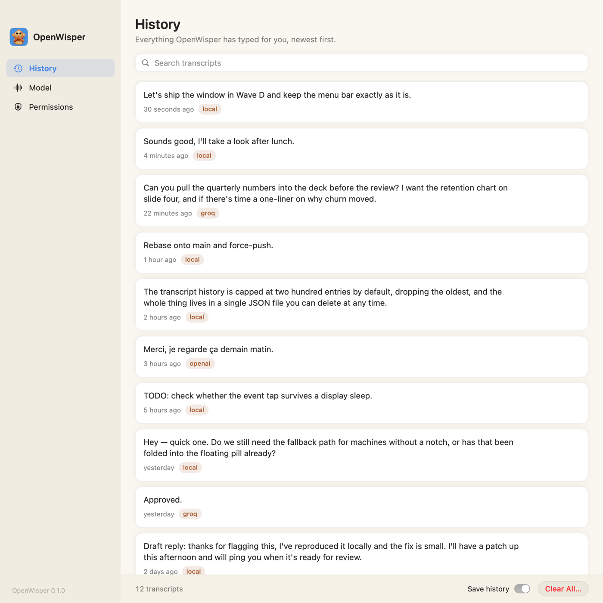
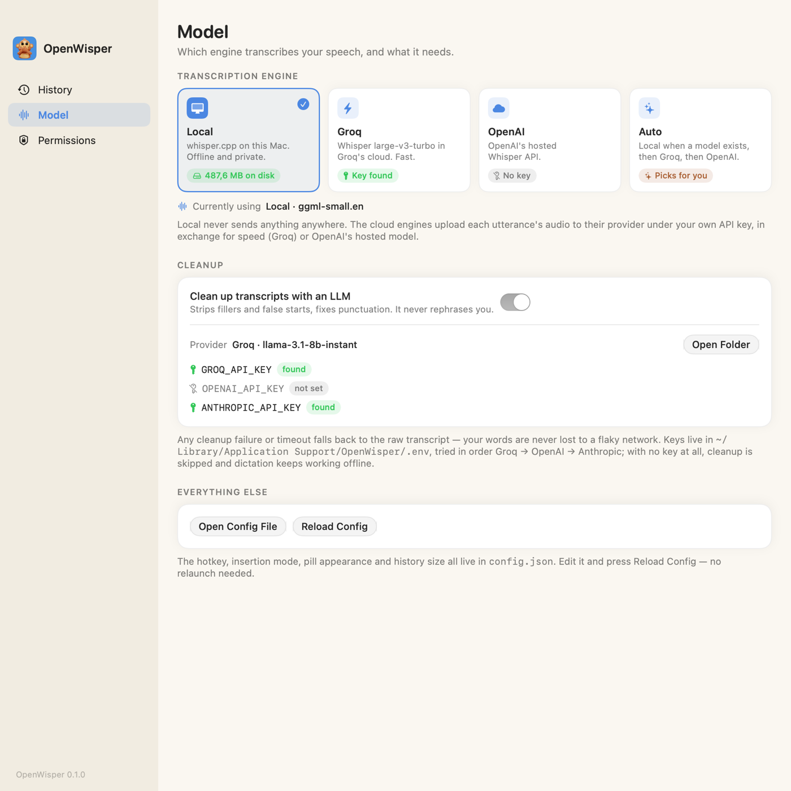
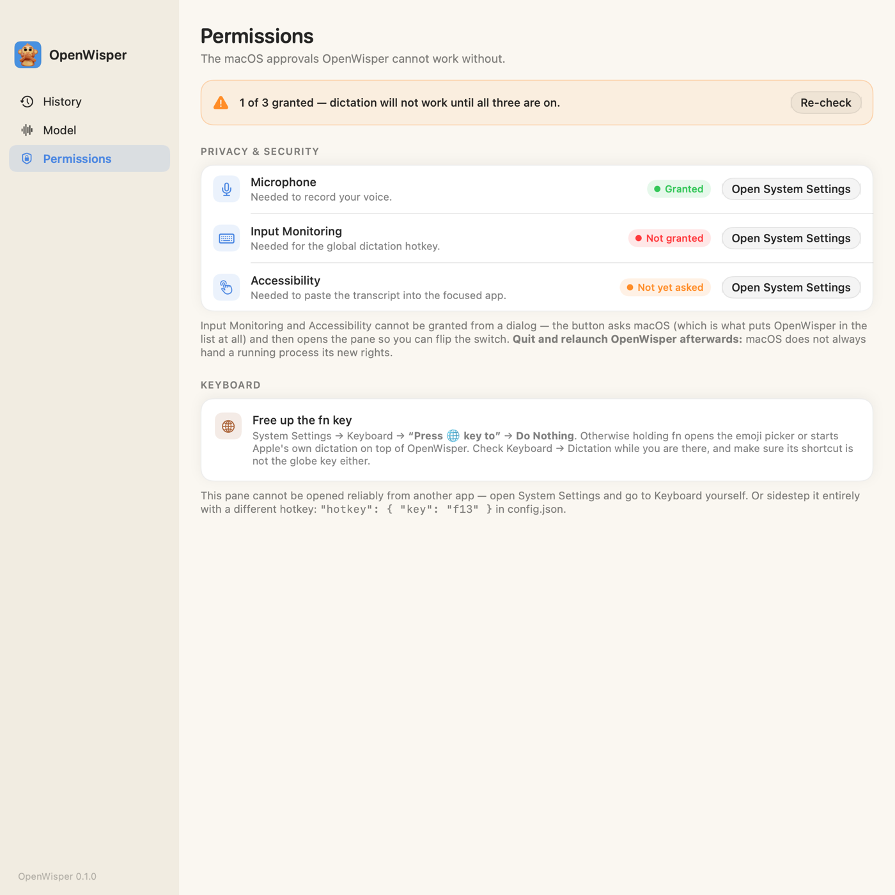

# OpenWisper

System-wide AI dictation for macOS that runs on your own machine. Hold a key,
talk, let go — the text lands at the cursor of whatever app has focus, cleaned
up into something you would actually send. Transcription runs locally through
[whisper.cpp](https://github.com/ggerganov/whisper.cpp), so it works with the
Wi-Fi off; cloud transcription and LLM cleanup are opt-in and use API keys you
supply. No account, no subscription, no telemetry, nothing phones home. It is
the self-hosted version of what Wispr Flow does.

macOS 14+. Built and tested on Apple Silicon (arm64).

<picture>
  <source media="(prefers-color-scheme: dark)" srcset="docs/screenshots/window-history-dark.png">
  
</picture>

## Quick start

Clone the repo, then:

```sh
make setup
```

That builds whisper.cpp, downloads the default model, and installs and launches
the app (a few minutes the first time). It opens on its Permissions page —
grant the three approvals it lists ([Permissions](#permissions) explains each),
then hold `fn` in any text field and talk. Everything below is the long form.

## How it feels

One key does both things, and you never think about which mode you are in.

**Hold to talk.**

1. **Hold `fn`** (configurable). On a MacBook the notch opens into a strip
   showing elapsed time, a live waveform of your voice, and a **✕**; on any
   other display a small glass pill appears at the bottom of the screen
   instead. Drag it out of the notch (or drag the pill) to put it wherever you
   like — it remembers that spot across launches, and dropping it back on the
   notch re-docks it. Click **✕** (or press `Esc`) to abandon the recording —
   or an in-flight transcription — and start over immediately.
2. **Speak.** Normally. Fillers and false starts are fine — they get cleaned up.
3. **Release `fn`.** The pill switches to processing, then the text is pasted
   where your cursor is. Your clipboard is put back the way it was.

**Double-tap for hands-free.** Tap `fn` twice quickly and the session locks:
recording keeps going with nothing held down, so you can sit back, gesture, walk
around, or dictate for a paragraph without your finger on a key. Recording
started on the *first* tap, so nothing you said in between is lost. **Tap once
more to stop** — the text is inserted exactly as it would be on a release.

**`Esc` cancels** at any point, held or hands-free: the recording is thrown away
and nothing is inserted.

A single tap that you do not double is treated as an accidental `fn` press and
discarded, so you can still use `fn` normally-ish. A hands-free session that you
forget about stops itself at `transcription.maxSeconds` (2 minutes by default)
and inserts what it heard. Nothing to focus, no app to switch to — it works in
Slack, Mail, a terminal, Xcode, a browser text box, all the same. (OpenWisper
*has* a window, for [history and settings](#the-app-window); dictation never
needs it.)

If you would rather have the old pure push-to-talk behavior, set
`"hotkey": { "mode": "hold" }`.

## Features

- **Local transcription** via whisper.cpp, statically linked, Metal-accelerated.
  The model stays resident in RAM between utterances, so there is no per-phrase
  model load. Fully offline.
- **Optional cloud STT** — Groq or OpenAI Whisper endpoints — when you want the
  speed or the accuracy of a larger model without running it locally.
- **LLM transcript cleanup** — removes fillers and false starts, fixes
  punctuation and casing, turns spoken "new paragraph" into an actual break. It
  never rephrases your content. **Any failure or timeout falls back to the raw
  transcript** — an utterance is never lost to a flaky network.
- **Clipboard-preserving paste** — the previous clipboard contents are
  snapshotted and restored after the paste (and skipped if another app changed
  the clipboard in the meantime, so nothing gets clobbered).
- **Floating pill indicator** with live input level, processing, and error
  states. Non-activating: it never steals focus from the app you are typing in.
- **Menu bar item** to enable/disable dictation, switch engines, check
  permissions, and quit. No Dock icon.
- **An app window** with three pages — [History](#the-app-window), Model and
  Permissions — opened from the menu bar and closed with `⌘W`. The app keeps
  running either way.
- **Local transcript history**, on by default: every transcript OpenWisper
  inserts is kept in one capped JSON file on your machine, with one-click copy.
  It is the safety net for a paste that landed nowhere. One switch turns it off,
  one button clears it — see [Privacy](#privacy).
- **Launch at login** via `SMAppService`, toggleable from the menu.
- **One JSON config file**, auto-created with sane defaults on first run.
- **No accounts, no telemetry, no analytics.** Audio never touches disk, and
  nothing you say leaves the machine unless you configure a cloud provider.

## Requirements

| | |
|---|---|
| macOS | 14.0 (Sonoma) or later |
| Hardware | Apple Silicon (arm64) — what this is built and tested on. Intel is untested. |
| Command Line Tools | `xcode-select --install` |
| CMake | `brew install cmake` — used to build whisper.cpp |
| Swift toolchain | Swift 5.9+. If your Command Line Tools SwiftPM is broken, see [Troubleshooting](#build-fails-with-a-swiftpm--manifest-error). |
| Disk | ~500 MB for the default model, up to ~1.6 GB for the largest |
| API keys | **None required.** Only for cloud transcription and/or LLM cleanup. |

## Install & build

One command, from the repo root:

```sh
make setup
```

It builds whisper.cpp, downloads the default model, installs
`OpenWisper.app` into `/Applications` and launches it. Give it a few minutes on
a cold clone — nearly all of that is compiling whisper.cpp, once.

Then work through [Permissions](#permissions) below. **Nothing will happen
until those are granted**, and OpenWisper has no Dock icon to remind you it is
there: look for the microphone in the menu bar.

If you would rather watch it happen a step at a time, `make setup` is the same
work as:

```sh
make deps      # clone + build whisper.cpp static libs into Vendor/  (a few minutes)
make model     # download the default ggml-small.en.bin model
make app       # swift build -c release, then assemble dist/OpenWisper.app
make install   # copy the bundle to /Applications
```

| Target | What it does |
|---|---|
| `make setup` | The whole thing: `deps` → `model` → `install`, then opens the app. What to run on a fresh clone. |
| `make deps` | Clones whisper.cpp at a pinned tag, builds it statically with Metal embedded, merges the archives into `Vendor/whisper-install/lib`, copies headers into `Sources/CWhisper/include`. Run once (and again after `make distclean`). |
| `make model` | Downloads a ggml model into `~/Library/Application Support/OpenWisper/models/`. `SIZE=…` picks which. |
| `make build` | `swift build -c release`. Requires `make deps` first. |
| `make app` | Builds, then assembles `dist/OpenWisper.app` (`LSUIElement`, ad-hoc signed). |
| `make install` | Runs `make app`, then replaces `/Applications/OpenWisper.app`. |
| `make smoke` | Offline end-to-end check: downloads `tiny.en` and transcribes a bundled JFK sample, printing the text and timings. Needs `make deps` first. The fastest way to confirm local transcription actually works. |
| `make test` | Unit tests. |
| `make run` | Dev run from the terminal. **Read the warning below.** |
| `make clean` | Removes `.build/` and `dist/`. |
| `make distclean` | Also removes `Vendor/` — you will need `make deps` again. |

Everything above accepts `CONFIG=debug` if you want a debug build.

### Choosing a model

```sh
make model SIZE=small.en           # default
make model SIZE=medium.en
```

| `SIZE` | File | Approx. size | Notes |
|---|---|---|---|
| `tiny.en` | `ggml-tiny.en.bin` | ~75 MB | Fast and rough. Used by `make smoke`. |
| `base.en` | `ggml-base.en.bin` | ~140 MB | Usable for short, clear dictation. |
| `small.en` | `ggml-small.en.bin` | ~470 MB | **Default.** The sweet spot: near-instant on Apple Silicon, accurate enough that cleanup handles the rest. |
| `small` | `ggml-small.bin` | ~470 MB | Multilingual version of the above. |
| `medium.en` | `ggml-medium.en.bin` | ~1.5 GB | Noticeably better on proper nouns, technical jargon, and accented speech. Costs a second or two per utterance and ~1.5 GB of resident RAM. Worth it if you dictate long-form or your accent trips up `small`. |
| `medium` | `ggml-medium.bin` | ~1.5 GB | Multilingual. |
| `large-v3-turbo` | `ggml-large-v3-turbo.bin` | ~1.6 GB | Best quality per second of the large family, multilingual. |

**`.en` vs. plain:** the `.en` models are English-only and are meaningfully more
accurate at English than the multilingual model of the same size. Use `.en`
unless you dictate in another language — then pick the plain variant and set
`transcription.language` to your language code (or `"auto"`).

> **If you download anything other than `small.en`,** it just works: OpenWisper
> prefers `ggml-small.en.bin`, but when that file is absent it automatically
> uses the **largest** `ggml-*.bin` in the models folder. Set
> `transcription.modelPath` only when you want to override that choice (for
> example, to force a smaller model while a larger one is also on disk):
>
> ```json
> "transcription": { "modelPath": "~/Library/Application Support/OpenWisper/models/ggml-base.en.bin" }
> ```

### A note on `make run`

`make run` launches the app unbundled, as a child of your terminal. macOS
attributes permission grants to the **terminal application**, not to
`OpenWisper.app` — so you would be granting Accessibility and Input Monitoring
to Terminal/iTerm/Ghostty, system-wide, forever. It is useful for a quick
compile-and-see loop, but **do real testing with `make install` and the app in
`/Applications`.**

## The app window

OpenWisper lives in the menu bar, but it does have a window. Click the menu bar
icon and choose **Open OpenWisper…** (`⌘O` while the menu is open), or
double-click the app in `/Applications` while it is already running. `⌘W`
closes it; the app keeps running.

The window's whole palette comes from the app icon — the blue it sits on, the
monkey's brown for the engine tags, its cream for the "all set" state — over
warm paper (or warm charcoal in dark mode). Both appearances are first-class;
`swift run window-demo` renders every page in both if you want to look without
building the app.

<p>
  <picture>
    <source media="(prefers-color-scheme: dark)" srcset="docs/screenshots/window-model-dark.png">
    
  </picture>
  <picture>
    <source media="(prefers-color-scheme: dark)" srcset="docs/screenshots/window-permissions-dark.png">
    
  </picture>
</p>

**History** — every transcript OpenWisper has typed for you, newest first, each
row with a one-click **Copy**. This page is the answer to the one way dictation
can fail invisibly: you spoke, the pill said it worked, and the paste landed
nowhere because nothing had keyboard focus. The words are still here. The
search field filters as you type, a right-click copies or deletes one entry,
clicking a row expands it, and **Clear All** empties the lot behind a
confirmation. The **Save history** switch turns recording off entirely.

**Model** — which engine is transcribing and what it needs. The engine picker
(the same one as the menu bar), the model file on disk and its size, and
whether each cloud key is present — presence only, never the key itself. Below
that, the cleanup switch and whichever provider it resolved to. Everything else
stays in `config.json`; there are buttons here to open it and to re-read it
without relaunching.

**Permissions** — live status of Microphone, Input Monitoring and Accessibility,
what each is for, and a button per row that asks macOS and then opens the right
System Settings pane. Plus the fn-key note, which is not a permission but stops
just as many people. The page re-checks itself while it is open, so you can
leave it up while you flip switches in System Settings and watch the dots turn
green.

## Permissions

This is the part that determines whether OpenWisper works at all. macOS gates
every capability it needs behind a separate approval, and two of them cannot be
granted from a dialog alone — you have to flip a switch in System Settings.

On first launch — and on any launch where something is missing — OpenWisper
opens its window on the **Permissions** page: live status per permission, a
button that asks macOS and then opens the right System Settings pane, and a
poll loop that turns the dots green as you flip switches. The menu bar item
shows a warning state until everything is in place. If you would rather do it
by hand, here is each one.

> After changing **Input Monitoring** or **Accessibility**, quit and relaunch
> OpenWisper (`⌘Q` from the menu bar item, then reopen). macOS does not always
> hand a running process its new rights.

### 1. Microphone

**Why:** to record your voice. Obviously.

1. Launch OpenWisper and hold the hotkey once. macOS shows a standard
   microphone prompt — click **Allow** and you are done.
2. If you dismissed it or previously denied: **System Settings → Privacy &
   Security → Microphone** → turn **OpenWisper** on.

### 2. Input Monitoring

**Why:** the global hotkey. OpenWisper installs a listen-only `CGEventTap` to
notice when you press and release `fn` anywhere in the system. It observes key
events; it does not modify or consume them.

1. **System Settings → Privacy & Security → Input Monitoring**
2. Turn **OpenWisper** on. If it is not in the list, click **+**, pick
   `/Applications/OpenWisper.app`, then turn it on.
3. Authenticate with Touch ID or your password when prompted.
4. **Quit and relaunch OpenWisper.**

### 3. Accessibility

**Why:** to put the text where your cursor is. Pasting is done by posting a
synthetic `⌘V` (or synthetic keystrokes in `type` mode) into the frontmost app,
and macOS only lets trusted apps post events to other apps.

1. **System Settings → Privacy & Security → Accessibility**
2. Turn **OpenWisper** on (again, **+** and select
   `/Applications/OpenWisper.app` if it is missing).
3. **Quit and relaunch OpenWisper.**

### 4. Free up the `fn` key

By default macOS already owns `fn`. If you leave it that way, holding it will
pop the emoji picker or start Apple's own dictation over the top of OpenWisper.

1. **System Settings → Keyboard**
2. Set **`Press 🌐 key to`** → **Do Nothing**.
3. Still in **System Settings → Keyboard**, open **Dictation** and make sure its
   shortcut is not bound to the globe/`fn` key — set it to **Off**, or to
   something else like *Press Control twice*. (Under older layouts this lives
   under **Keyboard Shortcuts… → Dictation**.)

Exact wording of these controls shifts slightly between macOS versions; the
setting you want is the one that decides what a bare `fn`/globe press does.

If you would rather not fight over `fn` at all, pick a different hotkey — a
function key you never use is the least intrusive choice:

```json
"hotkey": { "key": "f13" }
```

### Verifying

With all three granted and the app relaunched: open TextEdit, hold the hotkey,
say something, release. The pill should appear, then text. If it does not, jump
to [Troubleshooting](#troubleshooting).

## Configuration

`~/Library/Application Support/OpenWisper/config.json` — created with defaults
on first run. Edit it and relaunch OpenWisper for changes to take effect (some
settings, like the active engine, can also be changed from the menu bar).

The parser is forgiving: any key you omit or mistype falls back to its default,
and a file that fails to parse entirely is ignored in favor of defaults (with a
line in the log). You can safely keep only the keys you care about.

> **Upgrading?** A `config.json` that already says `"mode": "hold"` keeps
> working exactly as before — nothing about hold mode changed. Delete the `mode`
> line (or set it to `"flow"`) to get hold-*and*-double-tap on the same key.

```json
{
  "hotkey":        { "key": "fn", "mode": "flow", "minHoldMs": 250,
                     "doubleTapWindowMs": 300 },
  "transcription": { "engine": "local", "modelPath": null, "language": "en",
                     "groqModel": "whisper-large-v3-turbo",
                     "openaiModel": "whisper-1", "maxSeconds": 120 },
  "cleanup":       { "enabled": true, "provider": "auto", "model": null,
                     "timeoutSeconds": 6 },
  "insert":        { "mode": "paste", "restoreClipboardDelayMs": 600,
                     "copyToClipboard": true },
  "ui":            { "showPill": true, "playSounds": false, "useNotch": true },
  "history":       { "enabled": true, "maxEntries": 200 }
}
```

| Key | Default | Values / notes |
|---|---|---|
| `hotkey.key` | `"fn"` | `fn`, `rightCommand`, `leftCommand`, `rightOption`, `leftOption`, `leftControl`, `rightControl`, `f13`…`f19`, or `keycode:NN` for a raw key code. |
| `hotkey.mode` | `"flow"` | `flow` — hold to talk, **or** double-tap to lock hands-free (tap once more to stop; `Esc` cancels; auto-stops at `transcription.maxSeconds`). `hold` — pure push-to-talk, records only while held. `toggle` — tap to start, tap again to stop. Anything else falls back to `flow`. |
| `hotkey.minHoldMs` | `250` | The tap-vs-hold threshold. In `hold` mode a press shorter than this is discarded as an accidental tap; in `flow` mode it is what makes a press a *tap* — the thing that opens the double-tap window instead of ending the utterance. |
| `hotkey.doubleTapWindowMs` | `300` | `flow` mode only: how long after a tap a second tap still locks the session hands-free. A tap nobody doubles inside this window is discarded as accidental. `0` disables the hands-free lock, leaving hold-to-talk. |
| `transcription.engine` | `"local"` | `local` — whisper.cpp on your machine, offline. `groq` / `openai` — cloud, needs the matching key. `auto` — local if the model file exists, else Groq if `GROQ_API_KEY` is set, else OpenAI if `OPENAI_API_KEY` is set. |
| `transcription.modelPath` | `null` | Path to a ggml `.bin`; `~` is expanded. `null` means `ggml-small.en.bin` from the models folder, falling back to the largest downloaded `ggml-*.bin` when that file is absent. |
| `transcription.language` | `"en"` | ISO 639-1 code (`"en"`, `"de"`, `"fr"`, …) or `"auto"` to let whisper detect. Leave at `"en"` with any `.en` model — they are English-only. |
| `transcription.groqModel` | `"whisper-large-v3-turbo"` | Model used when `engine` resolves to `groq`. |
| `transcription.openaiModel` | `"whisper-1"` | Model used when `engine` resolves to `openai`. |
| `transcription.maxSeconds` | `120` | Hard cap on a single utterance. Audio past this is dropped — and a hands-free session (a locked `flow` session, or `toggle`) stops itself here and inserts what it heard, so walking away never leaves the mic open. |
| `cleanup.enabled` | `true` | `false` pastes the raw transcript and never touches the network for cleanup. |
| `cleanup.provider` | `"auto"` | `auto` — first provider that has a key, in order Groq → OpenAI → Anthropic. Or name one: `groq`, `openai`, `anthropic`. **With no keys at all, cleanup is silently skipped and dictation keeps working offline.** |
| `cleanup.model` | `null` | `null` uses the provider default: Groq `llama-3.1-8b-instant`, OpenAI `gpt-4o-mini`, Anthropic `claude-haiku-4-5-20251001`. |
| `cleanup.timeoutSeconds` | `6` | On timeout — or any cleanup error — the **raw transcript is pasted instead**. Your words are never lost. |
| `insert.mode` | `"paste"` | `paste` — clipboard + synthetic `⌘V`, previous clipboard restored. Fast, and correct for almost everything. `type` — synthetic Unicode keystrokes, one character at a time. Slower, but never touches the clipboard; useful for apps that mangle pasted text. |
| `insert.restoreClipboardDelayMs` | `600` | Paste mode with `copyToClipboard: false` only: how long to wait after `⌘V` before restoring the previous clipboard. Raise it if a slow app sometimes pastes the old contents. |
| `insert.copyToClipboard` | `true` | Keep the transcript on the clipboard after inserting — the safety net for a paste that landed nowhere (no text field focused): just `⌘V` it yourself. Set `false` to get the original behavior back: the previous clipboard contents are snapshotted and restored after every paste. |
| `ui.showPill` | `true` | The recording indicator. Its ✕ cancels the current recording or transcription. `false` for a completely invisible workflow. |
| `ui.useNotch` | `true` | On a MacBook with a notch, grow the indicator out of the camera cutout instead of floating it at the bottom of the screen. **Drag it out of the notch** and it comes straight out as the floating pill, which stays wherever you drop it (remembered across launches); drop it back over the notch to re-dock. Displays without a notch always use the floating pill. Set `false` to always float. |
| `ui.playSounds` | `false` | Start/stop feedback sounds. |
| `history.enabled` | `true` | Keep a local record of every transcript OpenWisper inserts, in `~/Library/Application Support/OpenWisper/history.json`. `false` stops recording new ones — it does not delete what is already there. Same switch as **Save history** in the window. See [Privacy](#privacy). |
| `history.maxEntries` | `200` | How many transcripts to keep; the oldest are dropped past this. Clamped to `1`…`10000`. Lowering it trims the file immediately, on the next reload. |

### `.env` — API keys

Keys live in a `.env` file, never in `config.json`. All of them are optional;
without any, OpenWisper runs fully offline with local transcription and no
cleanup.

```sh
cp .env.example ~/Library/Application\ Support/OpenWisper/.env
```

```sh
# Cloud Whisper transcription + fast LLM cleanup
GROQ_API_KEY=
# OpenAI Whisper API transcription + LLM cleanup
OPENAI_API_KEY=
# LLM cleanup via Claude
ANTHROPIC_API_KEY=
```

| Variable | Enables |
|---|---|
| `GROQ_API_KEY` | `transcription.engine: "groq"` and Groq cleanup |
| `OPENAI_API_KEY` | `transcription.engine: "openai"` and OpenAI cleanup |
| `ANTHROPIC_API_KEY` | Anthropic cleanup (Anthropic has no transcription endpoint) |

Precedence, highest first: **process environment** → **`.env` in the working
directory** (the repo root, when you `make run`) → **`~/Library/Application
Support/OpenWisper/.env`**. The installed app has no meaningful working
directory, so put the real file in Application Support; the repo-root `.env` is
a dev-run convenience. It is gitignored.

## How it works

Pressing the hotkey starts an `AVAudioEngine` tap that buffers 16 kHz mono
audio straight into memory. When the utterance ends — a release in hold mode, or
the stopping tap of a hands-free session — the buffer goes to a transcriber,
either a resident `whisper_context` running on-device or a WAV posted to a cloud
endpoint, and the raw text goes through a short, strict cleanup prompt with a
hard timeout. The result is appended to the local transcript history, then
written to the pasteboard, and a synthetic `⌘V` is posted to the frontmost app;
the previous clipboard is restored a beat later. History is written *before* the
paste is attempted, which is the whole point of it — an insertion that lands
nowhere still leaves the words somewhere you can get at them. The audio itself
is never written to disk.

The hotkey listener reports nothing but the physical key going down and up;
hold-vs-double-tap is decided entirely by the dictation state machine, which is
why a double tap can lock a session without ever restarting the recording.

```
fn down  ──►  Recorder            AVAudioEngine → 16 kHz mono Float32, RAM only
                                  pill: recording, live level

fn up    ──┬─ held ≥ minHoldMs ──► end the utterance (below)
           │
           └─ a tap ────────────► keep recording, wait doubleTapWindowMs
                                     ├─ 2nd tap ──► hands-free; the next tap
                                     │              ends the utterance
                                     └─ nothing ──► discard, insert nothing

         ──►  Transcriber         local: whisper.cpp, model resident in RAM
                                  cloud: WAV → Groq / OpenAI /audio/transcriptions
                                  pill: processing

         ──►  TranscriptCleaner   optional LLM pass, hard timeout
                                  on any failure ──► raw transcript

         ──►  TextInserter        save clipboard → set text → ⌘V → restore
                                  pill: done

Esc      ──►  cancel, nothing recorded, nothing inserted
```

## Troubleshooting

### The hotkey does nothing

In order of likelihood:

1. **Input Monitoring is not granted.** System Settings → Privacy & Security →
   Input Monitoring → OpenWisper on. **Then quit and relaunch the app** — the
   event tap is created at startup and a running process does not pick up the
   new grant.
2. **You rebuilt the app.** See [Permissions reset after every
   rebuild](#permissions-reset-after-every-rebuild).
3. **macOS still owns `fn`.** System Settings → Keyboard → `Press 🌐 key to` →
   **Do Nothing**, and check the Dictation shortcut. If holding `fn` opens the
   emoji picker, this is your problem.
4. **Dictation is toggled off** in the menu bar item.
5. **You are in a password field.** See [Nothing happens in password
   fields](#nothing-happens-in-password-fields).

### Pasting does nothing

The pill runs through recording and processing but no text appears: that is
**Accessibility**. System Settings → Privacy & Security → Accessibility →
OpenWisper on, then relaunch. Recording and transcription work without it; only
the final insertion needs it, which is why this failure looks like "everything
worked, then nothing happened."

If Accessibility *is* on and text still does not land, try
`"insert": { "mode": "type" }` — a few apps (some Electron and terminal apps)
handle synthetic `⌘V` badly but accept keystrokes.

### Permissions reset after every rebuild

`make app` **ad-hoc signs** the bundle. macOS identifies apps for TCC by their
code signature, and an ad-hoc signature changes with every build — so each
rebuild looks like a brand new, unknown app and you get to grant Input
Monitoring and Accessibility all over again. Sometimes you also have to remove
the stale entry (select it, click **−**) before the new one takes.

Fix it once with a self-signed identity, which stays stable across rebuilds:

1. Open **Keychain Access** → menu **Keychain Access → Certificate Assistant →
   Create a Certificate…**
2. Name: `OpenWisper Dev`. Identity Type: **Self Signed Root**. Certificate
   Type: **Code Signing**. Click **Create**.
3. Reinstall. Once that certificate exists in your keychain, plain
   `make install` finds and uses it automatically (`make_app.sh` prefers the
   `OpenWisper Dev` identity over ad-hoc; set `CODESIGN_IDENTITY=` explicitly
   only to override it). The first signing may ask you to allow codesign to
   use the key — click **Always Allow**.

```sh
make install
```

Grant the permissions once to that build, and they will survive subsequent
rebuilds as long as you keep signing with the same certificate. If you granted
things to earlier ad-hoc builds, clear the stale rows once first:

```sh
tccutil reset Microphone com.openwisper.app
tccutil reset ListenEvent com.openwisper.app
tccutil reset Accessibility com.openwisper.app
```

### Nothing happens in password fields

By design, and not something OpenWisper can or should work around. When a
secure input field has focus, macOS enables *secure event input*, which
suppresses key event delivery to event taps system-wide. Your hotkey is
invisible to OpenWisper for as long as that field is focused.

If dictation stops working *everywhere* and stays broken, an app may have left
secure input stuck on. Find the culprit:

```sh
ioreg -l -d 1 -w 0 | grep SecureInput
ps -p <the PID it printed>
```

Quitting that app releases it.

### "Whisper model not found"

Run `make model`. Any size works — when `ggml-small.en.bin` is absent,
OpenWisper falls back to the largest `ggml-*.bin` in the models folder, and an
explicit `transcription.modelPath` overrides everything. If the error persists,
check what is actually on disk with
`ls ~/Library/Application\ Support/OpenWisper/models/` and make sure
`modelPath` (if set) points at a real file.

### Permissions ended up on my terminal app

That is `make run` — it runs OpenWisper as a child of your terminal, so macOS
attributes the grants to the terminal. Revoke them in System Settings if you
would rather not leave your terminal with Accessibility and Input Monitoring
rights, and test with `make install` instead.

### Build fails with a SwiftPM / manifest error

Some Command Line Tools installs ship a broken SwiftPM (a
`libPackageDescription.dylib` that exports no symbols), which fails while
loading `Package.swift`. The Makefile already prefers a Homebrew toolchain at
`/opt/homebrew/opt/swift/bin/swift` when one exists:

```sh
brew install swift
```

To point it somewhere else — a swift.org toolchain, say — override `SWIFT`:

```sh
make app SWIFT=/Library/Developer/Toolchains/swift-latest.xctoolchain/usr/bin/swift
```

### `make deps` fails

Usually a missing CMake (`brew install cmake`) or missing Command Line Tools
(`xcode-select --install`). To start over from a clean slate:
`make distclean && make deps`.

### The text is not being cleaned up

Expected if you have no API keys — cleanup is skipped and you get the raw
transcript, which is the intended offline behavior. Otherwise check that
`cleanup.enabled` is `true`, that the key is in the `.env` the *installed app*
reads (`~/Library/Application Support/OpenWisper/.env`, not the repo root), and
that `cleanup.timeoutSeconds` is not so tight that every request times out and
falls back.

### Looking at logs

OpenWisper logs to the local unified log only.

```sh
log stream --predicate 'subsystem == "com.openwisper.app"' --level debug
```

## Privacy

- **No accounts.** There is nothing to sign up for and nothing to sign in to.
- **No telemetry, no analytics, no crash reporting, no update pings.** None of
  it exists in the code.
- **No network I/O at all** unless you configure a cloud engine or a cleanup
  provider *and* supply its key. With the default `local` engine and no `.env`,
  OpenWisper never opens a socket.
- **Audio never touches disk.** Samples live in memory for the length of an
  utterance and are released afterwards. There is no recordings folder and
  nothing to play back, ever.
- **Transcripts are kept locally, and that is on by default.** Every transcript
  OpenWisper inserts is appended to
  `~/Library/Application Support/OpenWisper/history.json`: plain JSON,
  owner-readable only, capped at 200 entries with the oldest dropped. It exists
  for one reason — a paste that landed nowhere is otherwise gone — and it is the
  only thing OpenWisper writes that contains anything you said. It is never
  uploaded, never synced, never sent anywhere. If you would rather not have it,
  switch **Save history** off in the window (or set
  `"history": { "enabled": false }`) and use **Clear All** to delete what is
  already there. Deleting the file by hand works just as well.
- **If you do enable a cloud provider,** be clear-eyed about what that means:
  your audio (cloud STT) or your transcript (cleanup) is sent to that provider
  under their terms. The local engine is the default precisely so this is an
  opt-in.
- **Logs** go to the macOS unified log on your machine and nowhere else.

## Uninstall

```sh
# the app
rm -rf /Applications/OpenWisper.app

# config, .env, transcript history (history.json), and downloaded models
rm -rf ~/Library/Application\ Support/OpenWisper

# forget the permission grants
tccutil reset Microphone com.openwisper.app
tccutil reset ListenEvent com.openwisper.app
tccutil reset Accessibility com.openwisper.app
```

Quit OpenWisper first. If you enabled launch at login, removing the app clears
it; you can confirm under **System Settings → General → Login Items**. Then
remove the entries from Privacy & Security → Input Monitoring / Accessibility
with the **−** button if `tccutil` left them listed.

In the repo, `make distclean` removes build output and the vendored whisper.cpp.
